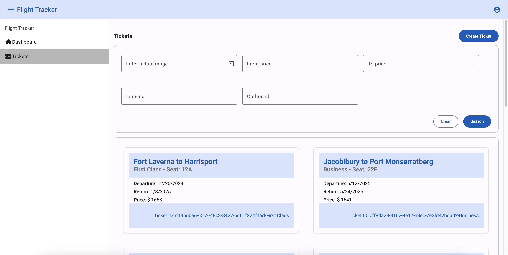
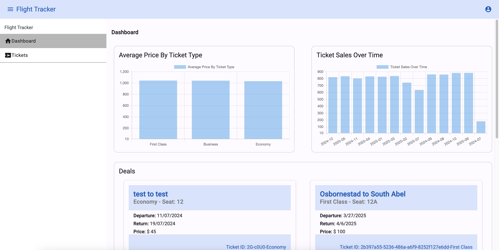

# Flight Tracker

## Overview

Flight Tracker is an Angular application for managing and tracking flight tickets.
The application supports two roles: Admin and User.
Users can view and filter tickets,
while Admins have additional privileges,
including the ability to create multiple tickets 

## Features

- **Login Page**: Users can log in with roles Admin and User.
- **User Role**:
  - View all tickets.
  - View dashboard
- **Admin Role**:
  - Same privileges as User.
  - Create multiple tickets 
- **Ticket Fields**:
  - `id`
  - `inbound`
  - `outbound`
  - `ticket_type`
  - `ticket_type_id` 
  - `price`
  - `from_date`
  - `to_date` or `date_range`
  - `seat_number`
- **Validation**:
  - No duplicate tickets for the same inbound, outbound, from, to, and seat_number values.
  - Price should be a positive number.
  - From date should be before the to date.
- **Dashboard**:
  - **Average Price By Ticket Type**: Average price of tickets by ticket type.
  - **Ticket Sales Over Time**: Number of tickets sold over time.
  - **Deals**: Special deals for users.
- **Chart**: Visualization based on ticket data.

- **Login Page**: Authenticate as Admin or User.
  
- **View and Filter Tickets**: Users and Admins can view and filter tickets.
  
- **Create Tickets**: Admins can create multiple tickets without redirection.
  
- **Validation**: Ensure no duplicate tickets are created.
- **Charts**: Visualize data such as revenue by ticket type, ticket sales over time, and average ticket price by ticket type.
  
